# VayuSetu

**A multimodal, citizen-science air quality platform for India, built entirely on Google Cloud free tiers.**

VayuSetu ("bridge of air" in Sanskrit) turns any WhatsApp user into an air quality sensor. A citizen photographs the sky, Gemini reads the image, Sentinel-5P satellite data adds the regional context, an XGBoost model forecasts the next twelve hours, and when a severe episode is predicted, municipal authorities receive voice calls and WhatsApp messages in their own language. Everything runs serverless, scales to national volumes, and stays inside Google Cloud's Always Free quotas during development and pilot deployments.

Built for the Google Cloud **Build with AI: Code for Communities** hackathon (India).

---

## Table of contents

1. [Why VayuSetu](#why-vayusetu)
2. [Architecture](#architecture)
3. [Repository layout](#repository-layout)
4. [Cost-optimised, free-tier architecture](#cost-optimised-free-tier-architecture)
5. [Quick start: local development](#quick-start-local-development)
6. [Deploying to Google Cloud](#deploying-to-google-cloud)
7. [Configuration reference](#configuration-reference)
8. [Data model](#data-model)
9. [Machine learning](#machine-learning)
10. [Testing and quality gates](#testing-and-quality-gates)
11. [Security and privacy](#security-and-privacy)
12. [Hackathon evaluation mapping](#hackathon-evaluation-mapping)
13. [Operational notes and known limitations](#operational-notes-and-known-limitations)
14. [Licence](#licence)

---

## Why VayuSetu

India has roughly 900 continuous ambient air quality monitoring stations for 1.4 billion people. Most cities have one or two, many districts have none, and hyper-local variation between a construction site, an arterial road and a residential lane is invisible to the official network. Meanwhile, more than 500 million Indians use WhatsApp every day.

VayuSetu closes the gap with three ideas:

1. **The camera is the sensor.** Gemini estimates haze, visibility and pollution sources from an ordinary photograph with structured, machine-readable output.
2. **Satellites provide the calibration.** Copernicus Sentinel-5P aerosol and NO2 columns from Google Earth Engine anchor each report in a physically measured context.
3. **Prediction, not just observation.** A custom XGBoost regressor fuses citizen, satellite and meteorological features into a 12-hour AQI forecast per 5 km grid cell, so authorities can act before a spike, not after.

## Architecture

```mermaid
flowchart LR
  citizen([Citizen on WhatsApp])
  authority([Municipal authority])

  subgraph intake["1 · Collect a local signal"]
    twilio["Twilio WhatsApp"]
    gateway["Cloud Run<br/>api-gateway"]
    firestore[("Firestore")]
    storage[("Cloud Storage")]
    twilio -->|signed webhook| gateway
    gateway -->|TwiML acknowledgement| citizen
    gateway -->|report metadata| firestore
    gateway -->|image + reportId| storage
  end

  citizen -->|photo + location| twilio
  storage -->|object.finalized| vision["Cloud Function<br/>process_citizen_image"]
  vision -->|structured image evidence| gemini["Gemini<br/>Google AI Studio"]
  vision -->|analysis| firestore

  subgraph context["2 · Add context"]
    gee["Cloud Function<br/>fetch_gee_metrics"]
    earth["Google Earth Engine<br/>Sentinel-5P + MODIS"]
    gee -->|satellite metrics| firestore
    gee --> earth
  end
  firestore -->|report created| gee

  vision --> bq[("BigQuery<br/>fused observations")]
  gee --> bq

  subgraph forecast["3 · Forecast the next 12 hours"]
    scheduler["Cloud Scheduler<br/>hourly"]
    batch["Cloud Function<br/>batch_predict"]
    weather["Open-Meteo<br/>weather context"]
    prediction["Cloud Run<br/>FastAPI + XGBoost"]
    scheduler --> batch
    weather --> batch
    batch -->|features| prediction
    prediction -->|AQI + confidence| batch
  end
  bq --> batch
  batch -->|predicted_hotspots| hotspots[("Firestore")]

  subgraph response["4 · Make the decision actionable"]
    alerts["Cloud Function<br/>send_authority_alerts"]
    translation["Cloud Translation<br/>+ Text-to-Speech"]
    outbound["Twilio Voice + WhatsApp"]
    hotspots -->|document.created| alerts
    alerts --> translation --> outbound --> authority
  end

  subgraph console["Authority console"]
    auth["Firebase Auth<br/>verified admin domain"]
    dashboard["Next.js dashboard<br/>Firebase Hosting"]
    auth -. sign-in gate .-> dashboard
    firestore --> dashboard
    hotspots --> dashboard
    alerts --> dashboard
  end

  classDef human fill:#e0f2fe,stroke:#0284c7,color:#0c4a6e
  classDef data fill:#ecfdf5,stroke:#059669,color:#064e3b
  classDef ai fill:#fef3c7,stroke:#d97706,color:#78350f
  classDef service fill:#eef2ff,stroke:#4f46e5,color:#312e81
  class citizen,authority human
  class firestore,storage,bq,hotspots data
  class gemini,earth,prediction ai
  class twilio,gateway,vision,gee,scheduler,batch,weather,alerts,translation,outbound,auth,dashboard service
```



### Request flow in detail

| Step | Component | What happens |
| --- | --- | --- |
| 1 | `services/api-gateway` | Twilio posts the WhatsApp message. The gateway validates the `X-Twilio-Signature`, deduplicates by `MessageSid`, resolves the citizen (HMAC-hashed phone number), and either stores a shared location or downloads the image. |
| 2 | `services/api-gateway` | The Firestore `citizen_reports/{reportId}` document is created **before** the image is uploaded so downstream functions always find the metadata. The image is written to `gs://<bucket>/reports/YYYY/MM/DD/<reportId>.jpg` with `reportId` in object metadata. A TwiML acknowledgement is returned in the citizen's language. |
| 3 | `functions/process_citizen_image` | Triggered by `google.cloud.storage.object.v1.finalized`. Downscales the image, calls Gemini through `google-generativeai` with a strict JSON response schema, walks a configurable model fallback chain on 404, retries HTTP 429 with exponential backoff and jitter, writes the analysis to Firestore and BigQuery, and sends the citizen a WhatsApp summary. |
| 4 | `functions/fetch_gee_metrics` | Triggered by `google.cloud.firestore.document.v1.created`. Queries `COPERNICUS/S5P/OFFL/L3_AER_AI`, `COPERNICUS/S5P/OFFL/L3_NO2`, `COPERNICUS/S5P/OFFL/L3_CO`, `COPERNICUS/S5P/OFFL/L3_SO2` and `MODIS/061/MCD19A2_GRANULES` within a 5 km buffer over the last three days, then merges the result into the report and BigQuery. |
| 5 | `functions/batch_predict` | Invoked hourly by Cloud Scheduler with an OIDC token. Reads the fused observations (BigQuery view, Firestore fallback), aggregates them into geohash-5 cells, enriches each cell with Open-Meteo meteorology (wind, humidity, boundary layer height), calls the prediction service, and writes `predicted_hotspots`. |
| 6 | `services/prediction-service` | FastAPI container on Cloud Run loading `model.joblib` (XGBoost). `POST /predict` returns the 12-hour AQI forecast, category and a confidence score per cell. Private: only the batch function's service account can invoke it. |
| 7 | `functions/send_authority_alerts` | Triggered when a hotspot document is created with `alertStatus = pending` (predicted AQI above the threshold, default 300). Claims the hotspot transactionally, finds authorities whose geohash coverage matches, translates the alert with Cloud Translation, synthesises speech with Text-to-Speech, places a Twilio voice call and sends a WhatsApp message, and logs everything to `alert_log`. |
| 8 | `frontend` | Static Next.js 14 export on Firebase Hosting. Google sign-in restricted to the configured administrator domain (enforced client-side, in Firestore security rules and in the gateway read API). Live map of hotspots and reports, trend charts, source breakdowns and the alert dispatch log. |

## Repository layout

```
.
+-- .github/workflows/          terraform.yml, backend-deploy.yml, frontend-deploy.yml
+-- infrastructure/terraform/   Complete GCP infrastructure (APIs, buckets, Firestore, BigQuery, IAM, secrets, Cloud Run, Scheduler, WIF)
+-- services/
|   +-- api-gateway/            Node.js 20 + TypeScript Express service (Twilio webhooks, GCS, Firestore)
|   +-- prediction-service/     Python 3.10 FastAPI + XGBoost inference container
+-- functions/
|   +-- common/vayusetu_common/ Shared library (retry with backoff, geohash, AQI, BigQuery sink, Twilio REST client)
|   +-- process_citizen_image/  Gemini vision analysis (Storage trigger)
|   +-- fetch_gee_metrics/      Earth Engine satellite metrics (Firestore trigger)
|   +-- batch_predict/          Hourly aggregation and forecasting (HTTP, Cloud Scheduler)
|   +-- send_authority_alerts/  Translation + TTS + Twilio voice/WhatsApp (Firestore trigger)
|   +-- Dockerfile              Local functions-framework image used by docker-compose
+-- ml/                         Feature engineering, synthetic data, training CLI, tests
+-- frontend/                   Next.js 14 App Router dashboard (TypeScript, Tailwind, Google Maps, Recharts, Firebase Auth)
+-- local/                      Firebase emulator image, event bridge, mock Twilio and mock Google AI Studio servers
+-- scripts/                    stage_functions.sh (deployment packaging), generate_mock_data.py (demo data),
                                deployment_preflight.sh and check_deploy_config.sh (deployment configuration gates)
+-- docs/                       BUILD_AND_DEPLOY.md, DEMO_SCRIPT.md, PITCH_DECK.md
+-- docker-compose.yml          Full local stack
+-- firebase.json               Emulator Suite, Hosting, Firestore rules and indexes
+-- .env.example                Every environment variable, documented
```

## Cost-optimised, free-tier architecture

VayuSetu was designed from the first line to run without a paid plan. Every managed service is used within its permanent free allocation, and the architecture avoids the components that would break that budget (Vertex AI AutoML, Cloud NAT, GKE, always-on VMs, streaming inserts, WaveNet voices).

| Capability | Service and free allowance | How VayuSetu stays inside it |
| --- | --- | --- |
| Image understanding | Google AI Studio (Gemini free tier, rate limited per minute and per day) | Images downscaled to 1024 px, one call per report, strict JSON to avoid re-prompting, exponential backoff on HTTP 429, configurable model fallback chain |
| Satellite data | Google Earth Engine non-commercial tier | Small 5 km buffer, three-day window, server-side `reduceRegion`, high-volume endpoint, deterministic mock for local runs |
| Forecasting | Custom XGBoost on Cloud Run (2 million requests, 360k GB-seconds and 180k vCPU-seconds free per month) | Replaces Vertex AI AutoML; model is a 2 MB joblib file; batch inference once per hour; scale-to-zero |
| Ingestion API | Cloud Run (same allowance) | Single lightweight Node container, minimum instances 0, request concurrency 80 |
| Event processing | Cloud Functions 2nd gen (2 million invocations and 400k GB-seconds free per month) | Four small functions, concurrency 1, bounded retries |
| Operational database | Firestore Native (1 GiB storage, 50k reads, 20k writes, 20k deletes per day free) | Compact documents, TTL on idempotency records, dashboard queries bounded by time window and limit |
| Analytics warehouse | BigQuery (10 GiB storage and 1 TiB queries per month free) | Batch load jobs instead of billed streaming inserts, partitioned tables, a single fused view |
| Object storage | Cloud Storage (5 GB-months Standard free) | Nearline after 30 days, deletion after 90 days, alert audio deleted after 7 days |
| Secrets | Secret Manager (6 active secret versions and 10k access operations free per month) | Exactly six secrets, mounted as environment variables once per instance |
| Scheduling | Cloud Scheduler (3 jobs free) | One hourly job |
| Translation | Cloud Translation (500k characters per month free) | Alerts are roughly 350 characters; cached per language within a run |
| Speech | Cloud Text-to-Speech (4 million Standard characters per month free) | Standard voices by default, WaveNet only when explicitly enabled |
| Messaging | Twilio WhatsApp sandbox and trial credit | Alerts are rate limited per authority with a three-hour cooldown per cell |
| Hosting and auth | Firebase Hosting Spark plan and Firebase Authentication | Static export, no SSR, Google provider only |
| Weather | Open-Meteo (free for non-commercial use, no key) | One call per 0.25 degree cell per run, cached |
| CI/CD | GitHub Actions free minutes, Workload Identity Federation (no service account keys) | Path-filtered workflows, matrix builds, deployment preflight that skips rather than fails an unconfigured target |

**Important:** Google Cloud requires a billing account to be *linked* before Cloud Run, Cloud Functions and Secret Manager can be enabled, even when usage stays inside the free tier. Linking an account does not incur charges by itself; VayuSetu's Terraform sets conservative `max_instances`, lifecycle rules and quotas so that a pilot deployment remains at zero cost. Budget alerts are recommended as a safety net.

An estimate for a city-scale pilot (5,000 reports per day, 24 batch runs per day, 20 alerts per day) lands at roughly 0 to 3 USD per month, dominated by Gemini calls beyond the free daily quota if the traffic grows. National scale (1 million reports per day) is discussed in `docs/PITCH_DECK.md`.

## Quick start: local development

The whole pipeline runs on a laptop without Google Cloud credentials. Docker Compose starts the Firebase Local Emulator Suite, a Cloud Storage emulator, mock Twilio and Google AI Studio servers, the gateway, the prediction service and all four functions.

### Prerequisites

- Docker Desktop or Docker Engine 24+ with Compose v2
- Node.js 20 and Python 3.10–3.12 (for running tests and the data generator on the host; the pinned grpcio version does not provide a Python 3.13 wheel)

### Start the stack

```bash
cp .env.example .env            # keep the local emulator values documented below
docker compose up --build       # first build takes a few minutes
```

The `gcs-init` one-shot service creates the configured citizen-image bucket in
fake-gcs-server before the API gateway starts. This is important when `.env`
contains a production-shaped bucket name from the template: the local emulator
must have that exact bucket name or image uploads return HTTP 404. If you are
updating an already-running stack, recreate the storage initializer and gateway
once:

```bash
docker compose up -d --build --force-recreate gcs gcs-init api-gateway
```

Build failures in this stack are almost always the network inside Docker Desktop,
not the code. Three signatures and what they mean:

- `tini (no such package)`, `v2 database format error`, `DNS: transient error` → the
  build container could not reach a package CDN. Set a working resolver
  (Settings → Resources → Network → DNS server, e.g. `8.8.8.8, 1.1.1.1`), update
  Docker Desktop, rerun `docker compose build --pull`.
- `lookup registry-1.docker.io: no such host` or
  `lookup production.cloudfront.docker.com: no such host`, both with *"Docker Desktop
  has no HTTPS proxy"* → the VM cannot download image layers. Docker Desktop →
  Resources → Proxies: set **Secure Web Proxy (HTTPS)** to the same address as the
  HTTP one (or clear both), then restart Docker Desktop. To build meanwhile -
  BuildKit never uses `docker pull`, the classic builder does:
  ```powershell
  powershell -ExecutionPolicy Bypass -File scripts\prepull_base_images.ps1 -Build
  docker compose up          # no --build needed; images are already built
  ```
- `No matching distribution found for <package>` → a requirements file lists a
  package PyPI does not know; that one is a real repo problem.
- A container exiting 127 with `/usr/bin/env: 'bash\r': No such file or directory`
  → Git checked the script out with CRLF. `.gitattributes` now pins LF and the
  `firebase` service self-repairs, so `git pull && docker compose up` is enough;
  normalise the checkout with `git config core.autocrlf false`,
  `git add --renormalize .`, `git commit`, and add `--build` to bake the clean
  script into the image.

Details, recovery commands and the shared-layer caveats:
[Build and deployment runbook](docs/BUILD_AND_DEPLOY.md).

Endpoints once everything is healthy:

| URL | Purpose |
| --- | --- |
| http://localhost:3000 | Dashboard (Next.js dev server, connected to the emulators) |
| http://localhost:4000 | Firebase Emulator UI (Firestore, Auth, Functions logs) |
| http://localhost:4010/_admin/log | Mock Twilio (outbound message and call log) |
| http://localhost:4020/healthz | Mock Google AI Studio |
| http://localhost:8081/healthz | API gateway |
| http://localhost:8090/docs | Prediction service (OpenAPI) |

### Sign in locally

The local Compose stack uses the reserved `example.com` domain so the Firebase
Auth emulator can accept fabricated accounts. The Google sign-in popup can
therefore use any verified-looking address ending in `@example.com`, including
`raccoon.mountain.509@example.com`. The data generator writes the same domain to
`config/access`, so the Firestore rules and dashboard stay in sync.

If you copied an older `.env.example`, add the local-only override before restarting:

```dotenv
LOCAL_ADMIN_DOMAIN=example.com
```

The deployed `ADMIN_DOMAIN` remains the real verified Workspace domain (for example,
`example.gov.in`); Docker Compose deliberately does not reuse it for emulator sign-in.

Then recreate the dashboard and emulator containers without removing their
volumes:

```bash
docker compose down
docker compose up --build
```

If the emulator already contains a dataset seeded for another domain, reseed
`config/access` as well:

```powershell
docker compose cp scripts/generate_mock_data.py fn-batch:/tmp/generate_mock_data.py
docker compose exec -T fn-batch sh -c "PYTHONPATH=/app python /tmp/generate_mock_data.py --emulator-host firebase:8080 --project vayusetu-local --admin-domain example.com --reports 240 --hours 48 --alert-failure-rate 0 --clear"
```

`example.com` is an emulator-only default. Before deploying, replace it with the
real, verified Google Workspace domain and never use the local bypass as a
production access policy.

### Seed demo data

```bash
python -m venv .venv && source .venv/bin/activate
pip install -r requirements-dev.txt          # already includes functions/common/requirements.txt
export FIRESTORE_EMULATOR_HOST=localhost:8080
python scripts/generate_mock_data.py --reports 500 --hours 48 --alert-failure-rate 0 --clear
```

Keep the default failure rate at zero for a clean judging demo. To demonstrate
resilience intentionally, rerun with a small value such as
`--alert-failure-rate 0.05`; those synthetic Twilio failures are chaos-test data,
not live delivery failures.

On Windows, the host generator can be run inside the already-built `fn-batch`
container instead of installing the pinned Python dependencies locally. This is
particularly useful with Python 3.13, where the pinned `grpcio` version falls
back to a native MSVC build:

```powershell
docker compose cp scripts/generate_mock_data.py fn-batch:/tmp/generate_mock_data.py
docker compose exec -T fn-batch sh -c "PYTHONPATH=/app python /tmp/generate_mock_data.py --emulator-host firebase:8080 --project vayusetu-local --admin-domain example.com --reports 500 --hours 48 --quiet-hours 3 --clear"
```

The generator creates 500 citizen reports, 80 pseudonymous citizens, periodic batch predictions, an escalating Delhi NCR smog event, matching authorities and a bilingual alert history. Add `--quiet-hours 3` before a live demonstration so that the next batch run produces fresh alerts that are not suppressed by the per-cell cooldown, and `--dry-run --json-out demo.json` to inspect the dataset without writing it. With the local defaults, sign in to the dashboard with any e-mail on `example.com` (the Auth emulator accepts fabricated Google accounts) to explore the data.

### Send a WhatsApp message end-to-end

```bash
# 1. Citizen shares their location
curl -s -X POST localhost:4010/simulate/inbound -H 'content-type: application/json' \
  -d '{"from":"+919876543210","latitude":28.6139,"longitude":77.2090,"profileName":"Asha"}'

# 2. Citizen sends a photo (media served by the mock Twilio server)
curl -s -X POST localhost:4010/simulate/inbound -H 'content-type: application/json' \
  -d '{"from":"+919876543210","media":"smoke_kanpur.jpg","body":"Burning garbage near the road"}'

# 3. Trigger batch prediction manually (the local scheduler also runs it every 10 minutes)
curl -s -X POST localhost:8085 -H 'content-type: application/json' -d '{"trigger":"manual","lookback_hours":6}'
```

Watch the report move from `received` to `analyzed` in the Emulator UI, the satellite metrics appear, a hotspot get created and, when the forecast exceeds 300, translated alerts land in the mock Twilio log at http://localhost:4010/_admin/log.

Sample media available on the mock server: `hazy_delhi.jpg`, `clear_bengaluru.jpg`, `smoke_kanpur.jpg`, `indoor_room.jpg`.

### Run the services individually

```bash
# Python
source .venv/bin/activate
pip install --prefer-binary -c functions/common/requirements.txt -r requirements-dev.txt \
            -r ml/requirements.txt -r functions/process_citizen_image/requirements.txt \
            -r functions/fetch_gee_metrics/requirements.txt -r functions/batch_predict/requirements.txt \
            -r functions/send_authority_alerts/requirements.txt -r services/prediction-service/requirements.txt
pip check
ruff check functions ml services/prediction-service scripts
# Run each component in its own process, as CI does: several functions define a
# top-level `main` module, so one combined collection would collide.
for component in functions/common functions/process_citizen_image functions/fetch_gee_metrics \
                 functions/send_authority_alerts functions/batch_predict \
                 services/prediction-service ml scripts/tests; do
  pytest "$component" -q || exit 1
done

# API gateway
cd services/api-gateway && npm ci && npm run lint && npm run typecheck && npm test

# Dashboard
cd frontend && npm ci && npm run lint && npm run typecheck && npm run build
```

## Deploying to Google Cloud

### 1. One-time project preparation

```bash
gcloud auth login
gcloud projects create vayusetu-prod --name="VayuSetu"      # or reuse an existing project
gcloud billing projects link vayusetu-prod --billing-account=XXXXXX-XXXXXX-XXXXXX
gcloud config set project vayusetu-prod
gcloud services enable cloudresourcemanager.googleapis.com serviceusage.googleapis.com iam.googleapis.com storage.googleapis.com

# Terraform remote state
gcloud storage buckets create gs://vayusetu-prod-tfstate --location=us-central1 --uniform-bucket-level-access
gcloud storage buckets update gs://vayusetu-prod-tfstate --versioning

# Register the project for Earth Engine (non-commercial): https://code.earthengine.google.com/register
# Create a Google AI Studio API key: https://aistudio.google.com/app/apikey
# Create a Twilio account and enable the WhatsApp sandbox: https://console.twilio.com
```

### 2. Provision infrastructure with Terraform

```bash
cd infrastructure/terraform
cp terraform.tfvars.example terraform.tfvars      # fill in project_id, github_repository, admin_domain, secrets
cp backend.hcl.example backend.hcl                # bucket = vayusetu-prod-tfstate
terraform init -backend-config=backend.hcl
terraform plan
terraform apply
terraform output github_repository_variables      # copy these into GitHub
```

Terraform creates the APIs, three buckets with lifecycle rules, Firestore (Native mode) with indexes and the TTL policy, the BigQuery dataset with four partitioned tables and the `fused_observations` view, six Secret Manager secrets, least-privilege service accounts and IAM bindings, Artifact Registry, both Cloud Run services (with placeholder images), the Cloud Scheduler job and the Workload Identity Federation pool for GitHub Actions. Sensitive variables can be supplied through `TF_VAR_*` environment variables instead of the tfvars file.

For dependency-resolution fixes, clean Docker rebuilds, first-time OIDC bootstrap, and failed-check recovery, see [Build and deployment runbook](docs/BUILD_AND_DEPLOY.md).

### 3. Configure GitHub Actions

Repository **variables** (from `terraform output github_repository_variables` plus a few frontend values):

`GCP_PROJECT_ID`, `GCP_REGION`, `GCP_WORKLOAD_IDENTITY_PROVIDER`, `GCP_DEPLOYER_SERVICE_ACCOUNT`, `GCP_TERRAFORM_SERVICE_ACCOUNT`, `TF_STATE_BUCKET`, `ARTIFACT_REGISTRY`, `CITIZEN_IMAGES_BUCKET`, `ALERT_AUDIO_BUCKET`, `ML_ARTIFACTS_BUCKET`, `PREDICTION_SERVICE_URL`, `API_GATEWAY_URL`, `ADMIN_DOMAIN`, `GEMINI_MODEL_CANDIDATES`, `ALERT_AQI_THRESHOLD`, `HOTSPOT_GEOHASH_PRECISION`, `GEE_PROJECT`, `ENVIRONMENT`, `FIRESTORE_LOCATION`, `BIGQUERY_LOCATION`, `NEXT_PUBLIC_FIREBASE_API_KEY`, `NEXT_PUBLIC_FIREBASE_AUTH_DOMAIN`, `NEXT_PUBLIC_FIREBASE_STORAGE_BUCKET`, `NEXT_PUBLIC_FIREBASE_MESSAGING_SENDER_ID`, `NEXT_PUBLIC_FIREBASE_APP_ID`, `NEXT_PUBLIC_GOOGLE_MAPS_API_KEY`, `NEXT_PUBLIC_GOOGLE_MAPS_MAP_ID`, `DEFAULT_MAP_CENTER`.

Repository **secrets** (used only by the Terraform workflow to populate Secret Manager): `TWILIO_ACCOUNT_SID`, `TWILIO_AUTH_TOKEN`, `TWILIO_WHATSAPP_FROM`, `TWILIO_VOICE_FROM`, `GOOGLE_AI_STUDIO_API_KEY`, `PHONE_HASH_SECRET`.

`terraform output github_repository_variables` prints the variables above as JSON;
the runbook shows the `gh variable set` loop that loads them in one pass. These are
non-secret configuration values, so they belong in *variables*, not secrets - the
workflows read `vars.*`, and a similarly named secret will not satisfy them.

No service account keys are stored anywhere; both deployment identities authenticate through Workload Identity Federation scoped to this repository.

Each workflow starts with a **deployment preflight** job that checks whether the
variables its deployment needs are present:

- **All variables present** - the deployment job runs, and any failure is a real
  failure.
- **Any variable missing** - the deployment job is **skipped**, the preflight
  reports the missing *names* (never values) as an annotation and in the run
  summary, and the test jobs still run and report normally.

That keeps an unbootstrapped project, a fork or a fresh clone green instead of red,
without inventing a successful deployment. A skipped deployment is not a
deployment: configure the variables, then re-run the workflow.

### 4. Workflows

| Workflow | Trigger | What it does |
| --- | --- | --- |
| `terraform.yml` | Changes under `infrastructure/terraform`, manual | `fmt -check` (always, without cloud access), then after the preflight: `init` against the GCS backend, `validate`, `plan` on pull requests (published as a pull request comment), `apply` on `main` or by manual dispatch, outputs exported as an artifact |
| `backend-deploy.yml` | Changes under `services`, `functions`, `ml`, manual | ESLint, type check and Jest for the gateway; Ruff and pytest for every Python component and the deployment regression tests; after the preflight, builds and pushes both containers to Artifact Registry, trains and uploads the XGBoost model when no published model exists, deploys both Cloud Run services and the four Cloud Functions (2nd gen) with their triggers and secrets, and smoke tests the endpoints |
| `frontend-deploy.yml` | Changes under `frontend`, manual | ESLint, type check and static export on every pull request; after the preflight, Firestore security rules and Firebase Hosting deployment on `main` |

The three workflows share `scripts/deployment_preflight.sh` (decides whether a
deployment can run) and `scripts/check_deploy_config.sh` (the strict gate inside the
deployment job itself). Both report variable *names* only, never values.

### 5. Connect Twilio and Firebase

1. In the Twilio console, set the WhatsApp sandbox inbound URL to `https://<api-gateway-url>/webhooks/twilio/whatsapp` (HTTP POST) and the status callback to `/webhooks/twilio/status`.
2. In the Firebase console, add the project, enable **Authentication > Google**, create a web app and copy the public config into the `NEXT_PUBLIC_FIREBASE_*` variables. Add the Firebase Hosting domain to the OAuth authorised domains.
3. Create a Google Maps JavaScript API key restricted to the Hosting domain; enable the Maps JavaScript API.
4. Add authority contacts to the `authorities` collection (see `scripts/generate_mock_data.py` for the schema) and confirm `config/access` lists your administrator domain.

## Configuration reference

All variables are documented in `.env.example`. The most important ones:

| Variable | Component | Description |
| --- | --- | --- |
| `GEMINI_MODEL_CANDIDATES` | vision function | Ordered fallback chain. Default `gemini-1.5-flash,gemini-flash-latest,gemini-3.5-flash-lite,gemini-2.5-flash`. Models that return 404 are skipped for the lifetime of the instance. |
| `GEMINI_API_ENDPOINT` | vision function | Optional override used by docker-compose to reach the mock server |
| `GEE_PROJECT`, `GEE_MOCK` | satellite function | Earth Engine project registration and deterministic mock mode |
| `ALERT_AQI_THRESHOLD` | batch and alert functions | Predicted AQI at or above which authorities are alerted (default 300, CPCB "very poor") |
| `ALERT_COOLDOWN_MINUTES` | alert function | Minimum interval between alerts for the same grid cell (default 180) |
| `WEATHER_PROVIDER` | batch function | `open-meteo` (default) or `synthetic` |
| `DATA_SOURCE` | batch function | `bigquery` (default, falls back to Firestore) or `firestore` |
| `ADMIN_DOMAIN` | gateway, dashboard, Firestore rules | Comma separated Google Workspace domains allowed to access authority views |
| `TWILIO_VALIDATE_SIGNATURE` | gateway | Must remain `true` in production |
| `PHONE_HASH_SECRET` | gateway | HMAC key that pseudonymises phone numbers before they are used as identifiers |

## Data model

### Firestore

| Collection | Key | Written by | Notes |
| --- | --- | --- | --- |
| `citizen_reports/{reportId}` | 32-hex UUID | gateway, vision function, satellite function | `location` (GeoPoint), `geohash` (precision 7), `status` (`received`, `analyzing`, `analyzed`, `failed`), `geminiAnalysis`, `estimatedAqi`, `pollutionSources`, `satelliteMetrics` |
| `users/{phoneHash}` | HMAC-SHA256 of the E.164 number | gateway | `phoneNumber` (needed to reply), `language`, `lastLocation`, `reportCount`. Never readable by clients. |
| `predicted_hotspots/{geohash5_YYYYmmddTHHMM}` | cell and run timestamp | batch function, alert function | `predictedAqi`, `predictedCategory`, `currentAqiEstimate`, `confidence`, `dominantSources`, `features`, `alertStatus` |
| `alert_log/{alertId}` | UUID | alert function | One document per authority and channel with Twilio SID, language and status |
| `authorities/{authorityId}` | slug | operators | `coverageGeohashes` (prefixes or `*`), `language`, `channels`, `phone`, `whatsapp`, `active`, `priority` |
| `config/access` | fixed | Terraform, operators | `adminDomains`, `adminEmails` consumed by security rules |
| `webhook_events/{messageSid}` | Twilio SID | gateway | Idempotency records, TTL seven days |
| `batch_runs/{runId}` | timestamp | batch function | Run summaries for observability |

### BigQuery (`vayusetu` dataset)

`citizen_reports`, `satellite_metrics`, `predicted_hotspots` and `alert_log` are partitioned by day and clustered by geohash and city. The `fused_observations` view joins vision and satellite rows per report and is the training and inference source for the model. Schemas live in `infrastructure/terraform/schemas`.

## Machine learning

- **Target:** `aqi_12h`, the AQI observed twelve hours after the observation window (from later citizen reports and, when available, CPCB station values).
- **Features (35):** Gemini vision aggregates (haze index, visibility, smoke, dust, open burning and fog ratios, vehicle, construction and industrial activity scores, vision AQI estimate and confidence, log report count), Sentinel-5P and MODIS columns (AER_AI, scaled NO2 and CO, AOD 470 nm), meteorology (temperature, humidity, wind speed and u/v components, precipitation, pressure, boundary layer height), derived interactions (stagnation index, combustion signal), temporal encodings (hour and month sine/cosine, day of week, weekend and winter flags) and location (latitude, longitude).
- **Model:** `xgboost.XGBRegressor` (600 trees, depth 6, learning rate 0.03, subsampling) trained with `ml/train_xgboost_model.py`. Synthetic training data with physically motivated relationships bootstraps the model before real data accumulates; the CLI reads CSV or BigQuery for retraining.
- **Evaluation:** on 8,000 synthetic observations the model reaches MAE 25.7 and R2 0.92 against a persistence baseline MAE of 46.5. Metrics are stored beside the artefact in `model_metrics.json`, and the prediction service exposes them at `GET /model/info`.
- **Confidence:** a heuristic combining report count, satellite availability, prediction extremity and the model's validation error, surfaced to the dashboard and included in alerts.

```bash
python ml/train_xgboost_model.py --source synthetic --rows 20000 --output ml/artifacts/model.joblib
python ml/train_xgboost_model.py --source bigquery --project vayusetu-prod --dataset vayusetu --output ml/artifacts/model.joblib
gsutil cp ml/artifacts/model.joblib gs://<project>-vayusetu-ml-artifacts/models/model.joblib
curl -X POST https://<prediction-service>/model/reload -H "Authorization: Bearer $(gcloud auth print-identity-token)"
```

## Testing and quality gates

| Component | Tooling | Coverage |
| --- | --- | --- |
| `functions/*`, `ml`, `services/prediction-service` | Ruff, pytest (87 tests) | Retry and backoff behaviour, geohash and AQI helpers, Gemini response validation and fallback chain, Earth Engine parsing and mock mode, alert composition and TwiML, batch aggregation and HTTP entry point, feature engineering, training and FastAPI contract |
| `services/api-gateway` | ESLint (typescript-eslint), `tsc`, Jest + Supertest (26 tests) | Twilio signature validation, media handling, ordering of Firestore write before upload, per-citizen hourly report limits, localisation, health and read API endpoints |
| `frontend` | ESLint (next/core-web-vitals), `tsc`, `next build` | Type safety and static export |
| `scripts/tests` | pytest (52 tests) | Deployment preflight and strict configuration checks, workflow gating and shell syntax, shared dependency staging, real Eventarc and Google client imports |
| `infrastructure/terraform` | `terraform fmt -check`, `terraform validate` (CI) | Configuration validity |

Every workflow blocks deployment when a gate fails, and every deployment job is
skipped - not failed - while the Google Cloud variables it needs are absent. A
green run on an unconfigured checkout therefore never implies that a deployment
happened: the preflight job lists exactly what is missing. See
[Build and deployment](docs/BUILD_AND_DEPLOY.md).

## Security and privacy

- Phone numbers are never used as identifiers or shown in the dashboard; `users` documents are backend-only and keyed by an HMAC of the number.
- Twilio webhooks are verified with the request signature; Cloud Run to Cloud Run calls use Google-signed OIDC tokens; Cloud Scheduler authenticates with OIDC; GitHub deploys through Workload Identity Federation.
- Each service account has only the roles it needs (see `infrastructure/terraform/iam.tf`): the vision function can read images but not write them, the alert function can write audio but not read citizen images, the prediction service can only read model artefacts.
- Firestore security rules grant read-only access to operational collections for verified accounts on the administrator domain, and deny all client writes.
- Secrets live in Secret Manager and reach containers as environment variables; nothing sensitive is committed.
- Images are moved to Nearline after 30 days and deleted after 90; alert audio is deleted after 7 days.

## Hackathon evaluation mapping

| Criterion | Where VayuSetu delivers |
| --- | --- |
| **Deep Google AI integration** | Gemini multimodal analysis with schema-constrained JSON (`functions/process_citizen_image`), Earth Engine satellite fusion (`functions/fetch_gee_metrics`), Cloud Translation and Text-to-Speech in ten languages (English and nine Indian languages) (`functions/send_authority_alerts`), custom XGBoost forecasting served on Cloud Run (`services/prediction-service`), Google Maps JavaScript API and Firebase Authentication in the dashboard |
| **India-scale scalability** | Fully serverless with scale-to-zero; geohash cell aggregation bounds prediction cost to the number of active cells rather than reports; BigQuery partitioning handles years of national data; WhatsApp as the ingestion channel needs no app install; multilingual alerts by design |
| **Deployability** | One `terraform apply`, three GitHub Actions workflows, Workload Identity Federation, containerised services, one-command local stack with emulators and mocks, comprehensive `.env.example` |
| **Technical execution** | Typed code with structured logging in every component, exponential backoff and idempotency throughout, 165 automated tests, strict Firestore rules, least-privilege IAM, documented data model and cost analysis |
| **Community impact** | Citizens receive an immediate, understandable analysis in their language; authorities receive actionable, localised forecasts before an episode peaks; all raw data flows into BigQuery for researchers |

## Operational notes and known limitations

- **Gemini model lifecycle.** The hackathon specification names `gemini-1.5-flash`. Google retires Gemini models regularly (the 1.5 family has already been shut down on the Gemini Developer API), so the vision function treats the configured model as the first entry in a fallback chain and advances automatically on HTTP 404. Keep `GEMINI_MODEL_CANDIDATES` current. The `google-generativeai` package is used as requested; it is in maintenance mode and a migration to `google-genai` is isolated to `gemini_client.py`.
- **Earth Engine latency.** Sentinel-5P Level 3 products lag real time by roughly a day; the function looks back three days and records how many granules contributed.
- **Ground truth.** The model ships trained on synthetic data so the pipeline works from day one. Real skill requires accumulating labelled data; the training CLI is ready for BigQuery-backed retraining and CPCB station joins.
- **Twilio sandbox.** The WhatsApp sandbox requires citizens to opt in with a join code and templates for business-initiated messages; a production WhatsApp Business account removes these limits.
- **Free-tier quotas.** Gemini free tier daily request caps bound the number of images analysed per day per key. The design degrades gracefully (reports remain `received` and are retried by Eventarc) rather than failing.
- **Terraform and Docker were not executed in the authoring environment**; configuration was validated structurally. Run `terraform validate` and `docker compose config` before first use.

## Licence

Apache License 2.0. See `LICENSE`.
